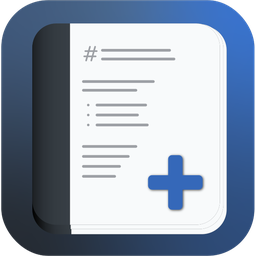
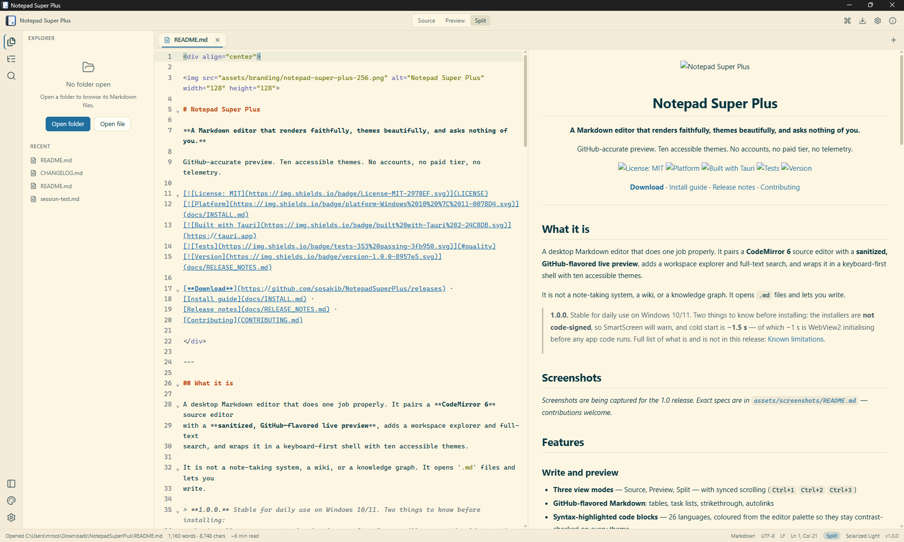
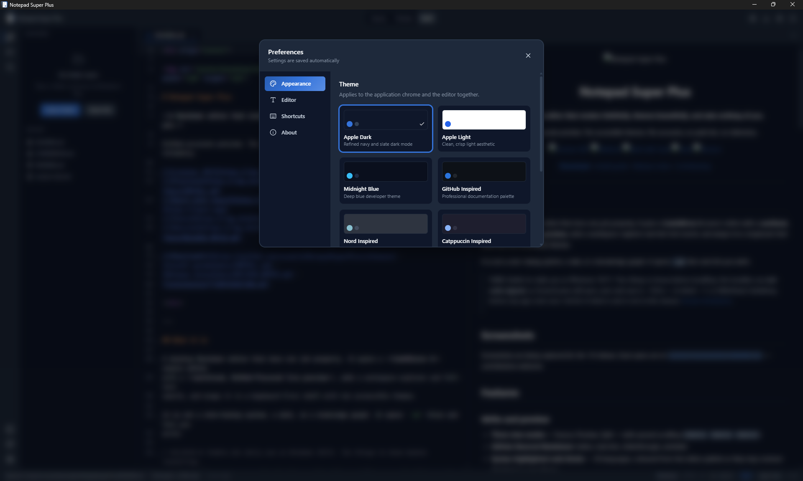

<div align="center">



# Notepad Super Plus

**A Markdown editor that opens fast, renders faithfully, and asks nothing of you.**

Notepad++-quick. GitHub-accurate preview. No accounts, no paid tier, no telemetry.

[](LICENSE)
[](docs/INSTALL.md)
[](https://tauri.app)
[](#quality)
[](docs/RELEASE_NOTES.md)

[**Download**](https://github.com/sosakib/NotepadSuperPlus/releases) ·
[Install guide](docs/INSTALL.md) ·
[Release notes](docs/RELEASE_NOTES.md) ·
[Contributing](CONTRIBUTING.md)

</div>

---

## What it is

A desktop Markdown editor that does one job properly. It pairs a **CodeMirror 6** source editor
with a **sanitized, GitHub-flavored live preview**, adds a workspace explorer and full-text
search, and wraps it in a keyboard-first shell with ten accessible themes.

It is not a note-taking system, a wiki, or a knowledge graph. It opens `.md` files and lets you
write.

> **This is a 0.9 pre-release.** The feature set is close to final and it is stable for daily
> use, but startup is ~1.3 s and there is no automated end-to-end test suite yet. Please read
> [Known limitations](docs/RELEASE_NOTES.md#known-limitations) before installing.

## Screenshots

<!-- Drop the four PNGs into assets/screenshots/ (specs in that folder's README) and uncomment.


-->

*Screenshots are being captured for the 1.0 release. Exact specs are in
[`assets/screenshots/README.md`](assets/screenshots/README.md) — contributions welcome.*

## Features

### Write and preview

- **Three view modes** — Source, Preview, Split — with synced scrolling (`Ctrl+1` `Ctrl+2` `Ctrl+3`)
- **GitHub-flavored Markdown**: tables, task lists, strikethrough, autolinks
- **Syntax-highlighted code blocks** — 26 languages, coloured from the editor palette so they
  stay contrast-checked on every theme
- Rendering happens in a **Web Worker** and is **sanitized before it touches the DOM** — the
  preview cannot execute anything a document puts in it
- **Frontmatter panel** — YAML metadata shown as a collapsible panel, not leaked into the body
- **Document outline**, live word and character counts, read-time estimate
- **Export** to standalone HTML, Markdown or plain text

### Work with folders

- **Session restore** — open tabs, caret positions, view mode and workspace come back on launch
- **Workspace explorer** — open a folder, browse lazily, create / rename / duplicate / trash
- **Deletes always go to the recycle bin.** There is no hard delete anywhere in the app
- **Workspace search** with regex, case and whole-word toggles, honouring `.gitignore`
- **Command palette** (`Ctrl+Shift+P`) with fuzzy matching — every command is keyboard-bindable

### Ten themes, all measured

Apple Dark · Apple Light · Midnight Blue · GitHub · Nord · Catppuccin · Everforest ·
Solarized Light · Minimal Monochrome · High Contrast

Every theme is held to **WCAG 2.2 contrast floors by an automated test** — 4.5:1 for text, 3:1 for
accent and status colours, plus a minimum separation across the text hierarchy so the three tiers
stay distinguishable. A palette that fails is a build failure, not a shipped regression. Themes
follow your OS light/dark preference.

### Windows integration

- **"Open with Notepad Super Plus"** in Explorer's right-click menu for `.md`, `.markdown`,
  `.mdown`, `.mkd`, `.mdx`, `.txt`
- File associations, **single-instance** launch (a second launch forwards its file and focuses
  the existing window), and files opened from the command line
- **Per-user install** — no admin rights required

### Files handled honestly

- **UTF-8 / UTF-16 / BOM** and **LF / CRLF** are detected and **preserved**, never silently rewritten
- **Atomic saves** — a crash mid-write cannot truncate your file
- **External-change detection** — clean buffers reload silently, dirty buffers raise a conflict banner

### Privacy

**Zero telemetry. Zero network calls.** No update check, no crash reporter, no remote resources
in the preview. The WebView runs under a strict CSP with no remote origin in any directive. Your
files never leave your machine.

## Install

Download the installer from [Releases](https://github.com/sosakib/NotepadSuperPlus/releases).

| File | Use if |
|---|---|
| `..._x64-setup.exe` | **Recommended.** Per-user NSIS installer, no admin prompt. |
| `..._x64_en-US.msi` | You deploy via Group Policy / Intune. |

Windows 10 or 11, 64-bit. The installers are **not code-signed yet**, so SmartScreen will warn —
[what that means and how to verify the download](docs/INSTALL.md).

## Supported files

`.md` · `.markdown` · `.mdown` · `.mkd` · `.mdx` · `.txt`

Opened as UTF-8, UTF-16 LE/BE, with or without BOM. Encoding and line endings round-trip
unchanged.

## Keyboard

| | |
|---|---|
| `Ctrl+Shift+P` | Command palette |
| `Ctrl+1` / `2` / `3` | Source / Preview / Split |
| `Ctrl+B` | Toggle sidebar |
| `Ctrl+O` / `Ctrl+S` | Open / Save |
| `Ctrl+W` | Close tab (asks if unsaved) |

Every command is in the palette with its live binding. Settings → Shortcuts lists the full keymap.

## Build from source

Node ≥ 20, pnpm 9, Rust ≥ 1.77, and the
[Tauri 2 Windows prerequisites](https://tauri.app/start/prerequisites/).

```sh
pnpm install
pnpm tauri dev        # run the desktop app
pnpm dev              # UI only in a browser (Tauri APIs degrade gracefully)
pnpm tauri build      # produce installers
```

Full details in [docs/BUILD.md](docs/BUILD.md).

## Quality

```sh
pnpm lint && pnpm typecheck && pnpm test
cargo test --manifest-path src-tauri/Cargo.toml
```

| Gate | Status |
|---|---|
| TypeScript tests | **342 passing** / 17 files |
| Rust tests | **36 passing** |
| `clippy -D warnings`, `fmt`, `eslint`, `prettier`, `tsc` | clean |
| `pnpm audit --prod` · `cargo audit` | **0 vulnerabilities** |

## Architecture

- **`src/`** — React 18 + TypeScript. Zustand holds metadata, CodeMirror owns document text,
  Markdown renders in a worker.
- **`src-tauri/`** — Rust core: encoding detection, atomic writes, workspace listing, search
  (`ignore` + `regex`), file watcher, TOML settings.
- All IPC goes through typed wrappers in `src/ipc/`; every Rust command returns a typed error.

The Rust surface is least-privilege: no shell, no HTTP, no `eval`. Design docs live in
[`docs/`](docs/) — start at
[`docs/20_Master_Project_Plan.md`](docs/20_Master_Project_Plan.md).

## Repository layout

```
assets/       icon masters, branding exports, screenshots
docs/         design docs, build & install guides, brand guidelines, historical reports
public/       static files served by Vite
release/      generated installer bundle (gitignored — see scripts/)
scripts/      build & release automation
src/          React + TypeScript frontend
src-tauri/    Rust core and Tauri config
tests/        end-to-end tests (not yet written — see roadmap)
```

## Roadmap

Toward **1.0**: an end-to-end test suite. Startup, session restore, syntax highlighting and the
frontmatter panel are done — see
[STARTUP_PERFORMANCE.md](docs/reports/STARTUP_PERFORMANCE.md). Tracked in
[`docs/reports/REMAINING_TASKS.md`](docs/reports/REMAINING_TASKS.md).

Beyond that: math and Mermaid rendering, GitHub callouts, PDF export, smart list continuation,
and a plugin API. See [`docs/ROADMAP.md`](docs/ROADMAP.md) and
[`docs/19_Future_Features.md`](docs/19_Future_Features.md).

## Contributing

Issues and pull requests are welcome — see [CONTRIBUTING.md](CONTRIBUTING.md) and the
[Code of Conduct](CODE_OF_CONDUCT.md). Good first contributions right now: screenshots, theme
proposals that fill a real gap, and the end-to-end test suite.

Security reports: [SECURITY.md](SECURITY.md). Design conventions:
[docs/BRAND_GUIDELINES.md](docs/BRAND_GUIDELINES.md).

## License

[MIT](LICENSE). Free and open source, forever — every feature is in the box.

<div align="center">
<sub>Built with <a href="https://tauri.app">Tauri 2</a>, <a href="https://codemirror.net">CodeMirror 6</a>, React and Rust.</sub>
</div>
