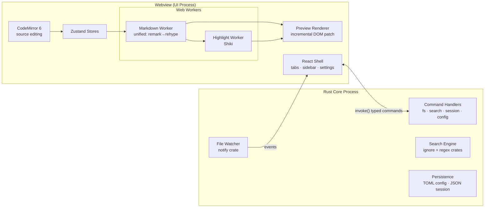

# 03 — System Architecture

**Related:** [02_Technology_Evaluation.md](02_Technology_Evaluation.md) · [05_Component_Design.md](05_Component_Design.md) · [06_Data_Flow.md](06_Data_Flow.md) · [07_File_System_Architecture.md](07_File_System_Architecture.md) · [16_API_Design.md](16_API_Design.md)

---

## 1. Overview

Notepad Super Plus is a two-process Tauri 2 application:

- **Core (Rust)** — owns everything that touches the OS: filesystem, file watching, workspace search, encoding detection, session/config persistence, dialogs, window management, updater.
- **UI (webview: React + TypeScript)** — owns everything the user sees: editor (CodeMirror 6), Markdown preview pipeline (unified), structure view, file tree, tabs, search UI, settings UI. Heavy pure-computation (parsing, highlighting) runs in **Web Workers**, never the UI thread.



## 2. Process responsibilities

### 2.1 Rust core

| Module (crate: `nsp-core`) | Responsibility |
|---|---|
| `fs` | Read/write with atomic saves, encoding + line-ending detection (`encoding_rs`), trash-delete, rename/duplicate/move, path canonicalization + scope validation |
| `watcher` | Debounced recursive workspace watching (`notify`); per-open-file change detection; emits `fs:changed` events |
| `search` | Workspace search: `ignore` walker (gitignore-aware) + `regex`; streams batched matches as events; cancellation tokens |
| `session` | Session snapshot (tabs, cursors, scroll, modes) as JSON; crash-recovery drafts |
| `config` | TOML load/parse/validate/watch; defaults merge; portable-mode resolution ([07_File_System_Architecture.md](07_File_System_Architecture.md) §3) |
| `export` | Standalone-HTML assembly; print-to-PDF trigger |
| `menu`, `window` | Native menus, shortcuts registration, window state persistence |

Rules: every command is `async`, non-blocking (heavy work on `tokio::task::spawn_blocking`), returns `Result<T, NspError>` with typed error codes ([16_API_Design.md](16_API_Design.md) §5). No command panics across the IPC boundary.

### 2.2 Webview UI

| Layer | Contents |
|---|---|
| Shell | Window chrome, tab bar, sidebar (file tree / outline / search panels), status bar, command palette, settings |
| Editor | CodeMirror 6 instance per visible tab; Markdown language pkg + custom extensions (smart lists, pair-close, table nav) |
| Preview | Rendered HTML from Markdown Worker, patched incrementally per changed block; virtualized for huge documents |
| Workers | `md.worker.ts` (unified pipeline → HAST + outline + line-map), `shiki.worker.ts` (code-block tokens, lazy grammars) |
| State | Zustand stores: `documents`, `tabs`, `workspace`, `search`, `settings`, `ui` ([05_Component_Design.md](05_Component_Design.md) §5) |

## 3. Key architectural decisions

### 3.1 Document ownership (single source of truth)

The **CodeMirror document (in the UI process)** is the authoritative text while a file is open. Rust never mutates an open document; it only loads, saves, and reports external changes. This avoids a two-master sync problem. Consequence: very large files are still held in webview memory — mitigated by CM6's rope structure and the large-file policy (§3.4).

### 3.2 Incremental preview pipeline

Full re-parse per keystroke is O(document) and fails NFR-3. Instead ([06_Data_Flow.md](06_Data_Flow.md) §3):

1. Debounced (75 ms idle) doc snapshot → Markdown Worker.
2. Worker splits document into **top-level blocks** (micromark block boundaries), memoizes parse/render per block hash.
3. Only changed blocks re-render; DOM patched per block key.
4. Worker also emits: outline tree (headings + source lines) and **line map** (source line → block id) powering scroll/cursor sync.

### 3.3 Scroll & cursor sync (split mode)

Source ↔ preview mapping uses the line map from §3.2. Sync is *leader-based*: whichever pane the user last interacted with leads; follower scrolls via `scrollIntoView` on mapped block with interpolation between block boundaries. Prevents feedback loops by suppressing follower events for 150 ms after programmatic scroll.

### 3.4 Large-file policy (NFR-3)

| Size | Behavior |
|---|---|
| < 4 MB | Full features |
| 4–32 MB | Preview switches to virtualized block rendering (render only viewport ± overscan); Shiki depth-limited |
| > 32 MB | "Large file mode": source mode default, preview on demand (virtualized), some editor extensions (e.g., whitespace viz) auto-disabled; banner informs user |
| Load | Rust streams file in chunks; UI shows content at first chunk; editor usable before full load completes |

### 3.5 Events vs commands

- UI → Core: **commands** (`invoke`) — request/response, typed.
- Core → UI: **events** (`emit`) — watcher notifications, search-result streams, config-change broadcasts.
Full catalog in [16_API_Design.md](16_API_Design.md).

### 3.6 Security posture (summary; full model in [08_Security_Model.md](08_Security_Model.md))

- Strict CSP (no remote origins, no `unsafe-eval`); preview HTML passes `rehype-sanitize` allowlist.
- Tauri capability files grant only: fs within user-opened scopes, dialog, window, updater. No shell, no arbitrary fs.
- All paths validated in Rust against the workspace/open-file scope set (anti path-traversal).
- Mermaid/KaTeX render in the same sanitized pipeline with scripts disabled.

## 4. Repository structure

```
notepad-super-plus/
├── apps/
│   └── desktop/                  # The Tauri application
│       ├── src/                  # React + TS frontend
│       │   ├── components/       # Reusable UI primitives (Button, Tree, Tooltip…)
│       │   ├── editor/           # CodeMirror setup, extensions, keymaps
│       │   ├── viewer/           # Preview renderer, block patcher, virtualizer
│       │   ├── sidebar/          # File explorer, outline (structure view), panels
│       │   ├── search/           # Find bar, workspace search UI
│       │   ├── settings/         # Settings UI + schema
│       │   ├── renderer/         # unified pipeline config, worker clients
│       │   ├── state/            # Zustand stores
│       │   ├── workers/          # md.worker.ts, shiki.worker.ts
│       │   ├── ipc/              # Typed invoke wrappers + event subscriptions
│       │   └── styles/           # Design tokens, themes
│       └── src-tauri/            # Rust core
│           ├── src/
│           │   ├── commands/     # IPC command handlers (thin)
│           │   ├── fs/  watcher/  search/  session/  config/  export/
│           │   └── error.rs      # NspError taxonomy
│           ├── capabilities/     # Tauri permission manifests
│           └── tauri.conf.json
├── packages/
│   ├── markdown-core/            # Shared unified pipeline config (used by app + tests)
│   └── themes/                   # Bundled theme token JSON
├── docs/                         # This documentation set
├── design/                       # Wireframes, tokens source, icons ([04] §)
├── specifications/               # GFM conformance fixtures, keymap spec
├── tests/  e2e/                  # Cross-cutting test assets ([10])
├── scripts/                      # Build/release/benchmark scripts
└── .github/workflows/            # CI/CD ([10] §7, [18])
```

Rationale per folder is one line each on purpose: structure is monorepo-lite (pnpm workspaces) so `markdown-core` is testable against the GFM spec suite without booting the app.

> **Execution refinement (Stage 0):** the Windows-first execution plan starts with the standard **flat Tauri layout** — `src/` (frontend) + `src-tauri/` (Rust) at the repository root — rather than the `apps/desktop` + `packages/*` monorepo shown above. The `packages/` split (extracting `markdown-core`/`themes`) is deferred until there is a second consumer to justify the overhead, and is re-evaluated at **Stage 4** ([../ROADMAP.md](../ROADMAP.md)). The module *responsibilities* in this section are unchanged — only their on-disk root moves. This keeps early setup simple without a Windows-only assumption.

## 5. Cross-cutting concerns

- **Error handling:** Rust `NspError` enum serialized with `code`, `message`, `path?`; UI maps codes to toasts/dialogs; never raw panics to user.
- **Logging:** `tracing` (Rust) + leveled console logger (TS) → rotating file in app-data (off by default at `info`, no content logging ever).
- **i18n:** English-only v1; all strings behind a `t()` shim so extraction is mechanical later.
- **Windowing:** single window v1; architecture keeps per-window state in stores so multi-window (P2) is additive.

## 6. Alternatives considered at architecture level

- **Rust-side Markdown parsing (pulldown-cmark/comrak):** faster raw parse, but doubles the pipeline (outline/scroll-map would need a second JS-side structure) and IPC-ships large HTML payloads per keystroke. Worker-side unified keeps parse, outline, and line map as one artifact with zero IPC on the hot path. Revisit only if worker parse p95 exceeds budget on reference hardware.
- **Monaco:** rejected — see [02_Technology_Evaluation.md](02_Technology_Evaluation.md) §5.
- **SQLite session/index:** rejected v1 — files suffice; indexing revisited with workspace-symbol search (P2).
