# 20 — Master Project Plan

**The index and single source of truth for sequencing.** Read this first; every other document is one hop away.

---

## 1. What we are building

**Notepad Super Plus** — an MIT-licensed, cross-platform (Win/mac/Linux) desktop Markdown editor: Notepad++-fast, GitHub-faithful rendering, three modes (source / preview / split with sync), live outline navigation, workspace explorer, powerful search — and nothing else. Full pitch: [00_Project_Vision.md](00_Project_Vision.md).

**Stack (decided, [02_Technology_Evaluation.md](02_Technology_Evaluation.md)):** Tauri 2 + Rust core · React + TypeScript + Vite · CodeMirror 6 · unified (remark/rehype) in a Web Worker · Shiki · Zustand · TOML config · no database.

**Headline budgets (non-negotiable, [09_Performance_Strategy.md](09_Performance_Strategy.md)):** < 500 ms cold start · < 150 MB idle · 100 MB files without freezing · < 15 MB installer · zero telemetry (CI-verified).

## 2. Document map

| # | Document | Owns |
|---|---|---|
| 00 | [Project Vision](00_Project_Vision.md) | Why, principles, non-goals, success criteria |
| 01 | [Product Requirements](01_Product_Requirements.md) | Numbered FR/NFR — the contract phases build against |
| 02 | [Technology Evaluation](02_Technology_Evaluation.md) | 6-framework comparison, weighted scoring, ADR-0001 |
| 03 | [System Architecture](03_System_Architecture.md) | Process split, incremental pipeline, repo layout |
| 04 | [UI/UX Guidelines](04_UI_UX_Guidelines.md) | Tokens, layout, motion, themes, shortcuts, a11y gates |
| 05 | [Component Design](05_Component_Design.md) | Hierarchy, contracts, CM6 extensions, stores, workers |
| 06 | [Data Flow](06_Data_Flow.md) | Canonical flows: open/edit/save/sync/search/session |
| 07 | [File System Architecture](07_File_System_Architecture.md) | Scopes, atomic I/O, watching, app-data, large files |
| 08 | [Security Model](08_Security_Model.md) | Threat model, sanitization, CSP, supply chain, privacy |
| 09 | [Performance Strategy](09_Performance_Strategy.md) | Budgets, startup/memory plans, bench infra |
| 10 | [Testing Strategy](10_Testing_Strategy.md) | Pyramid, corpora, e2e journeys, CI workflows |
| 11 | [Roadmap](11_Roadmap.md) | v0.1 → v1.0 → v2.0, governance, permanent non-goals |
| 12 | [Implementation Phases](12_Implementation_Phases.md) | 12 phases with AC, risks, effort — the build plan |
| 13 | [Coding Standards](13_Coding_Standards.md) | TS/Rust rules, dependency policy, review checklist |
| 14 | [Git Workflow](14_Git_Workflow.md) | Trunk-based, squash, SemVer, hotfix, repo settings |
| 15 | [Contribution Guide](15_Contribution_Guide.md) | Setup, rules, governance, community |
| 16 | [API Design](16_API_Design.md) | Full IPC command/event/error catalog |
| 17 | [Plugin System Proposal](17_Plugin_System_Proposal.md) | Future sandboxed extension design (no v1 code) |
| 18 | [Release Checklist](18_Release_Checklist.md) | Gate list executed every release |
| 19 | [Future Features](19_Future_Features.md) | Parking lot with verdicts; rejected-ideas record |

## 3. Execution sequence

```mermaid
gantt
    dateFormat  X
    axisFormat  %s
    section Foundation
    P1 Architecture & Scaffold      :p1, 0, 3
    section Parallel A
    P2 Core Editor                  :p2, after p1, 4
    P3 Markdown Engine              :p3, after p1, 5
    section Middle
    P4 Explorer & Workspace         :p4, after p2, 5
    P5 Rendering Views              :p5, after p3, 5
    section Parallel B
    P6 Search                       :p6, after p4, 3
    P7 Settings & Commands          :p7, after p2, 4
    section Finish
    P8 Themes & A11y                :p8, after p5, 3
    P9 Enhancements & Export        :p9, after p7, 4
    P10 Hardening                   :p10, after p9, 4
    P11 Optimization                :p11, after p10, 3
    P12 Release                     :p12, after p11, 3
```

≈ 46 engineer-weeks; 2 engineers ≈ 6–7 months, solo ≈ 12 ([12] §14). Milestones map to versions in [11].

## 4. Operating rules (summary of binding decisions)

1. **Docs before code, tests with code.** No phase starts before its dependencies' acceptance criteria are CI-green.
2. **Budgets are gates.** Perf/security/a11y regressions block merge — schedule slips take scope, never quality ([12] buffer policy).
3. **The webview touches no filesystem.** All I/O through the scoped Rust command catalog ([16]).
4. **Preview mutations round-trip through source.** One source of truth, always undoable ([06] §9).
5. **No telemetry, no network** beyond user-initiated updates — machine-verified every CI run (NFR-4).
6. **Small IPC, small dependency set, small PRs.** Additions need written justification ([13] §7–8).
7. **Non-goals are load-bearing.** [00] §6 / [19] rejected-table end scope debates by link, not argument.

## 5. Immediate next steps

1. **Maintainer review of this docs set** — especially ADR-0001 ([02] §6) and the phase plan ([12]). Approval = green light for Phase 1.
2. Phase 1 kickoff: repo scaffold per [03] §4, CI skeleton per [10] §7, budgets baselined per [09] §7.
3. Open GitHub: repo + labels + templates + Discussions + project board per [14] §8 / [15].

## 6. Risk register (top 5, consolidated)

| Risk | Phase | Mitigation |
|---|---|---|
| WebKitGTK (Linux) rendering divergence | 5, 8 | Conservative CSS baseline; Linux visual CI from Phase 5; ADR revisit trigger ([02] §6) |
| Incremental-render correctness bugs | 3 | Property tests (incremental ≡ full) built before features; fuzz nightly |
| Scroll-sync jank on huge docs | 5 | Block-height cache + interpolation; budget test in CI day one |
| Solo-maintainer bus factor | all | Docs-as-contract (this set); succession in `MAINTAINERS.md` ([15] §7) |
| Scope creep toward IDE/Obsidian | all | [19] verdict tables + BDFL-lite governance |
